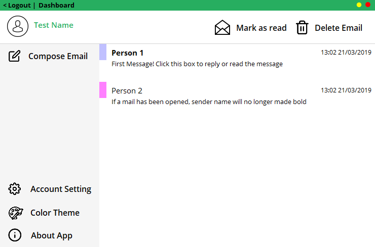
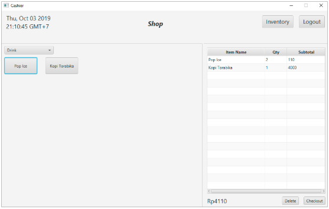
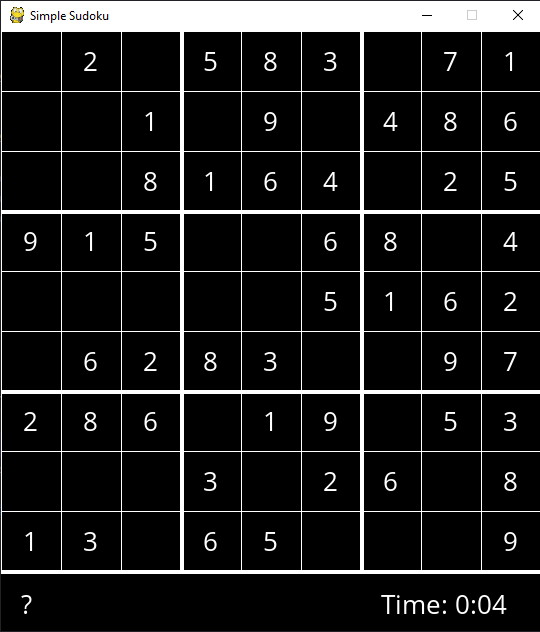

Last Updated 29 August 2020

Hello! My name is Andrean, a second-year Computer Science student. Here I share some of projects I created. It consists of my personal project and few college class final project.

# [Project 1: Flutter To Do App](https://github.com/andreanlay/todo-flutter)
* To Do App created using Flutter
* Fully connected with Google Firebase as backend

# [Project 2: Deep Reinforcement Learning Tetris AI](https://github.com/andreanlay/tetris-ai-deep-reinforcement-learning)
* An AI learned to play Tetris using Value Function based Deep Reinforcement Learning
* Hand-engineered features are used to predict the quality of each possible state
* AI try to check each possible state and choose the best state that yield maximum future reward which make it possible to clear multiple lines
* 2 x 64 neurons hidden layer were used as the Deep Q Network

# [Project 3: Handwritten Character Recognition Using CNN](https://github.com/andreanlay/handwritten-character-recognition-deep-learning)
* NIST and MNIST dataset were used to train the network
* Using data augmentation to produce more relevant data for the network to learn
* Modified LeNet5's architecture and learnable pooling layers were used  

  

# [Project 4: Mailfy - Email Application](https://github.com/andreanlay/mailfy-email-app)
* Created entirely using VB .NET Winform with no additional library used

# [Project 5.1: Cashier Inventory App](https://github.com/andreanlay/cashier-inventory-javafx)
* Cashier Inventory App with database  
* Using JavaFX 12

# [Project 5.2: Cashier Inventory Web Application](https://github.com/andreanlay/cashier-inventory-web-spark-java)
* Cashier Inventory App with database
* Using Spark Framework 2.9.1

# [Project 6: Space Shooter Game](https://github.com/andreanlay/space-shooter-sdl2)
* Made using C++ with SDL2 library

# [Project 7: Sudoku Game](https://github.com/andreanlay/simple-sudoku-pygame)
* Made using Python and Pygame
* Backtracking algorithm was used to check board answer

